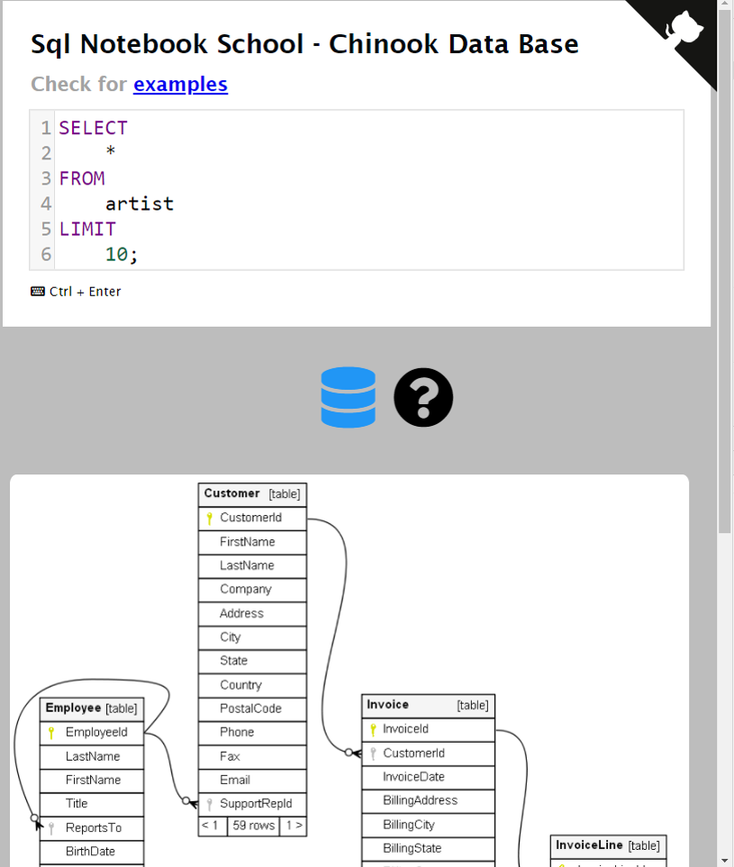

# sql-notebooks

Quick environment to learn SQL with NOTEBOOK STYLE using WEB SQL -- [LIVE DEMO](https://pavelsjo.github.io/sql-notebooks-school/)

## Why?

Getting started with SQL requires a database system and their initial setup could be difficult, because in most cases pre-requisites are necesary as:

- Select a data base motor
- Create a local data base or from cloud vendor
- Get credencials
- Get connections
- Install conection tools ot libraries
- Create tables, insert new data, etc...

So, this notebook sql enviroment is redy to use directly in web browser in cliente side with any pre-requisite and their purpose is learn SQL.

## Chinook Data Base

As you can se in first image, this data base run directly in the web browser and chinook data base is ready to use.

## Limitations

Web SQL is a fetuare based in [sql lite](https://www.sqlite.org/index.html) data base, but their use is not suported for [W3 comunity](https://www.w3.org/TR/webdatabase/) and consecuently is not suported by all browser, so please check [suported browsers](https://caniuse.com/sql-storage).

## Third party code

To create this repo was necesary use sqcripts from [lerocha](https://github.com/lerocha/chinook-database) and json data from [marko-knoebl](https://github.com/marko-knoebl/chinook-database-json).
